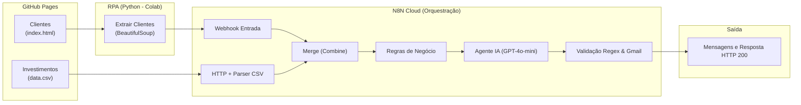

# 🤖 Assistente de Investimentos com RPA e IA Generativa

Projeto desenvolvido como parte do **Bootcamp Santander 2026 - Automação com N8N** na [DIO](https://dio.me).

O projeto consiste em um pipeline completo de automação inteligente combinando **RPA (Robotic Process Automation) em Python**, **orquestração de microsserviços no n8n** e **geração de mensagens consultivas personalizadas com IA Generativa (LLM)**.

---

## 🏗️ Arquitetura do Projeto



---

## 🎯 Entregáveis do Desafio

### ✅ MVP (Mínimo Viável)
- [x] Repositório forkado com o workflow N8N implementado
- [x] Workflow N8N exportado (`n8n/workflow.json`) com mensagens dinâmicas e estáticas
- [x] Script de RPA integrado ao Webhook do N8N (`rpa/extrair_clientes.ipynb`)
- [x] Fluxo testado e validado funcionando de ponta a ponta com resposta HTTP 200

### 🚀 Desafio Completo (IA Generativa & Automação Avançada)
- [x] Integração com nó de LLM / OpenAI (`gpt-4o-mini`) via n8n AI Gateway
- [x] Engenharia de Prompt com regras rígidas de Compliance Financeiro (sem promessa de lucros ou garantias)
- [x] Normalização de campos de e-mail (`to`, `subject`, `text_body`, `html_body`)
- [x] Validação defensiva com nó If e Regex (`^[^\s@]+@[^\s@]+\.[^\s@]+$`) antes do disparo por e-mail
- [x] Organização visual no canvas com notas adesivas (Sticky Notes) semânticas e categorizadas por cores

---

## ⚙️ Tecnologias e Ferramentas

| Etapa | Ferramenta | Função |
| :--- | :--- | :--- |
| **Hospedagem de Dados** | GitHub Pages | Servir a página HTML dos clientes e o CSV de opções de investimento |
| **Extração (RPA)** | Python + BeautifulSoup + Requests | Coletar dados da tabela HTML e disparar POST para o Webhook |
| **Orquestração** | n8n Cloud | Integrar fontes, unificar dados (Merge) e orquestrar pipeline |
| **Inteligência Artificial** | OpenAI GPT-4o-mini | Geração de redação humanizada, consultiva e em compliance |
| **Validação** | Nó If (Regex) | Garantir formato válido de e-mail antes do nó de entrega |

---

## 📂 Estrutura do Repositório

```text
dio-lab-assistente-investimentos-rpa-n8n/
├── n8n/
│   └── workflow.json          # Workflow completo exportado do n8n
├── rpa/
│   └── extrair_clientes.ipynb # Notebook Python com automação de extração
├── documentos/
│   ├── index.html             # Tabela de clientes fictícios
│   └── data.csv               # Tabela de produtos de investimento
└── README.md                  # Documentação completa do projeto
```

---

## 👨‍💻 Autor

Desenvolvido por **Gustavo** durante o Bootcamp Santander 2026 - Automação com N8N na plataforma DIO.
